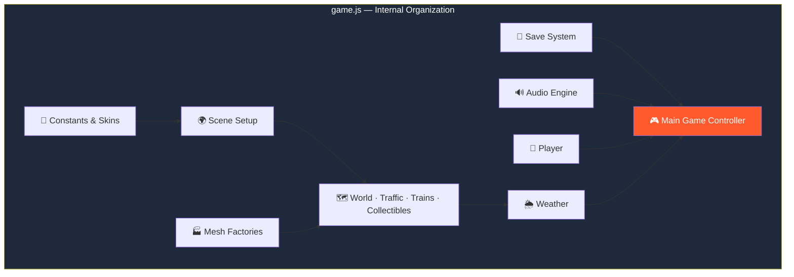

# 🦆 Duck Road

<div align="center">


**A playable 3D endless road-crossing arcade game.**

*Built from scratch with Three.js and vanilla JavaScript — no game engine, no external art/audio assets, no copied characters or branding.*

[🎮 How to Run](#-how-to-run-it) • [✨ Features](#-whats-implemented) • [🕹️ Controls](#-controls) • [🏗️ Architecture](#-project-structure) • [🛍️ Meta Systems](#-meta-systems)

</div>

---

## 📖 Overview

**Duck Road** is a complete 3D endless runner built entirely from code. Hop across an endless procedurally-generated world — country roads, highways, rivers, railways, and villages — and see how far you can go.

Every visual is drawn from Three.js primitives. Every sound is synthesized with the Web Audio API. Every duck is built procedurally. There are **no external art or audio files to host, load, or license.**

### Core Idea

> **One page. One library. Everything else, generated live.**
>
> A full 3D arcade experience with zero asset pipeline, zero build step, and zero external dependencies beyond a single CDN.

---

## 🚀 How to Run It

### The Quick Version

1. Unzip or keep `index.html` and `game.js` in the **same folder**
2. Open `index.html` in a modern desktop or mobile browser
   - Chrome · Edge · Safari · Firefox — all supported
3. You need an **internet connection on first load only** — the page fetches Three.js from `cdnjs.cloudflare.com`

Everything else — models, sounds, game logic — is generated on the fly.

### Optional — Host Anywhere

Drop the folder on any static web host:

- **GitHub Pages**
- **Netlify**
- **A simple local server:** `python3 -m http.server`

No build step required.

---

## 🕹️ Controls

### Desktop

| Key | Action |
|-----|--------|
| `W` / `↑` | Forward |
| `S` / `↓` | Back |
| `A` / `←` | Left |
| `D` / `→` | Right |
| `Esc` | Pause |

### Mobile

| Input | Action |
|-------|--------|
| **Swipe** | Move in any direction |
| **On-screen pad** ▲ ◀ ▼ ▶ | Move (bottom-right corner) |

---

## ✨ What's Implemented

<div align="center">

| 🌍 Endless Procedural World | 🦆 Full Duck Animation |
|:---:|:---:|
| Country roads · Highways · Rivers · Railways · Villages · Forests | Hops · Waddle · Wing-flap · Scared wobble · Sinking · Spin celebration |
| **🎯 Core Stats** | **📈 Difficulty Curve** |
| 3 lives · Score · Distance · Bread counters · Game over and restart | Traffic speed/density and train frequency increase with distance |
| **🍞 Bread Currency** | **🎨 13 Duck Skins** |
| Saved permanently via `localStorage` | Simple procedural accessories — crown, shades, cowboy hat, cape, chef hat, and more |
| **🛍️ In-Game Shop** | **⚡ 6 Power-Ups** |
| Spend bread on ducks, a cosmetic trail, and a "free starting shield" perk | Shield · Bread Magnet · Speed · Extra Life · Flying Duck · Slow Time |
| **🏆 10 Achievements** | **🌦️ Dynamic Weather & Time** |
| Toast notifications for each unlock | Sunny · Cloudy · Rain · Fog · Sunset · Night — with tinted lighting and fog |
| **🔊 Procedural Audio** | **💾 Full Save System** |
| Footsteps, bread pickup, collisions, splashes, train bell, achievement chime — all synthesized | Best score · Bread · Unlocked ducks · Selected duck · Achievements · Settings |
| **📱 Mobile-Ready** | **♻️ Rolling Window Rendering** |
| Touch controls + swipe support + responsive layout | Generated rows are culled and disposed to stay smooth over long sessions |

</div>

### 🌍 The World

Everything is generated procedurally from Three.js primitives:

- **Country road** — open lanes with light traffic
- **Highway-style traffic** — fast-moving vehicles at speed
- **Rivers** with floating logs — hop across moving platforms
- **Railway crossings** with warning lights and bells — trains come fast
- **Safe grass, village, and forest stretches** — breathers between dangers

### 🦆 The Duck

- **Grid-based movement** with a smooth hop animation
- **Waddle / wing-flap idle animation** — alive even when standing still
- **Scared / hit wobble** — physical feedback on near-misses and impacts
- **Sinking-in-water animation** — if you land in the river
- **Spin-and-hop celebration** on achievement unlocks

### ⚡ Power-Ups

| Power-Up | Effect |
|----------|--------|
| 🛡️ **Shield** | Absorbs one hit |
| 🧲 **Bread Magnet** | Attracts nearby bread |
| ⚡ **Speed** | Temporary speed surge |
| ❤️ **Extra Life** | +1 life |
| 🦅 **Flying Duck** | Temporary flight |
| ⏱️ **Slow Time** | Slows incoming hazards |

### 🌦️ Weather & Time-of-Day

Dynamic cycling with tinted lighting and fog:

- ☀️ Sunny
- ☁️ Cloudy
- 🌧️ Rain *(with particle effects)*
- 🌫️ Fog
- 🌅 Sunset
- 🌙 Night

### 🏆 Achievements

Ten unlockable awards with toast notifications.

### 🔊 Procedural Audio

All sound is generated live with **Web Audio API** — no audio asset files:

- Footsteps
- Bread pickup
- Collisions
- Splashes
- Power-ups
- Train bell
- Achievement chime
- **A tiny looping background jingle**

> 💡 Real `.mp3` / `.ogg` files could be swapped in later by extending the `Audio_` object.

---

## 🛍️ Meta Systems

### 🍞 Bread — The Currency

Bread is the in-game collectible currency. It's saved permanently via `localStorage` and can be spent in the shop.

### 🎨 13 Unlockable Duck Skins

**Classic Duck is free.** The other 12 are unlocked with bread.

Skins come with simple procedural accessories:

| Accessory | Skin |
|-----------|------|
| 👑 Crown | Royal Duck |
| 🕶️ Shades | Cool Duck |
| 🤠 Cowboy Hat | Cowboy Duck |
| 🦸 Cape | Hero Duck |
| 👨🍳 Chef Hat | Chef Duck |
| 🎩 Top Hat | Fancy Duck |
| 🥷 Ninja Headband | Ninja Duck |
| *(and more…)* | |

### 🛒 The Shop

Spend bread on:

- **Ducks** — unlock new skins
- **A cosmetic trail** — visual flair behind your duck
- **A "free starting shield" perk** — begin each run with a shield

> 🛡️ **No real-money purchases anywhere.** Everything is earned through play.

---

## 🏗️ Project Structure

```
duck-road/
├── index.html          # Page shell — loads Three.js, sets up the canvas
└── game.js             # The entire game
```

### Why One File?

Because this needs to run as a **single portable page with zero build step or server**.

The game logic lives in one `game.js` file rather than a deeper `/js/*.js` module split — but it's organized internally into **clearly-labelled sections**, each commented with the module name it corresponds to:



This makes it **easy to split into separate files later** if you want a bundler-based project instead — each section maps directly to a module.

---

## ♻️ Performance

The game keeps a **rolling window of generated rows** ahead of and behind the duck and **disposes their geometry when culled**. This is what keeps the game smooth over long sessions — memory doesn't grow with distance traveled.

---

## 📝 Notes / Next Steps

### How It's Built

- **All 3D art is procedural** — built from Three.js primitives
- **All audio is procedurally synthesized** — generated live with Web Audio API

This is **by design** — no external assets were provided, and this approach means the game ships with zero asset files and zero licensing concerns.

### Drop-In Enhancements

Swapping in real models or sound files is a **drop-in enhancement**:

| What to Add | Where to Extend |
|-------------|-----------------|
| **3D models** | `buildDuck()` · `buildVehicle()` · etc. — place files in `/assets/models` |
| **Sound files** | The `Audio_` object — place files in `/assets/audio` |

No architectural changes required.

---

## 🌐 Browser Support

| Browser | Status |
|---------|--------|
| Chrome (desktop & mobile) | ✅ Full Support |
| Firefox (desktop & mobile) | ✅ Full Support |
| Safari (desktop & iOS) | ✅ Full Support |
| Edge (desktop) | ✅ Full Support |

> Requires **WebGL** (for Three.js) and **Web Audio API** (for sound). If Web Audio is unavailable, the game continues silently.

---

## 🗺️ Roadmap

### ✅ Current

- [x] Endless procedurally-generated world
- [x] Country roads, highways, rivers, railways, villages, forests
- [x] Full duck animation set (hop, waddle, wobble, sink, celebrate)
- [x] 3 lives, score, distance, bread counters
- [x] Game-over screen with restart
- [x] Progressive difficulty (traffic, trains)
- [x] Bread collectible currency with `localStorage` persistence
- [x] 13 unlockable duck skins with procedural accessories
- [x] In-game shop (ducks, trail, starting shield perk)
- [x] 6 power-ups
- [x] 10 achievements with toast notifications
- [x] Dynamic weather and time-of-day cycling
- [x] Fully procedural Web Audio sound and music
- [x] Full save system
- [x] Mobile-responsive layout with touch and swipe controls
- [x] Rolling window rendering with geometry disposal

### 🔜 Future Ideas

- [ ] Real 3D models as optional drop-in assets
- [ ] Real sound files as optional drop-in assets
- [ ] Additional worlds (city, beach, mountain pass)
- [ ] More duck skins and accessories
- [ ] Boss encounters at distance milestones
- [ ] Daily challenges with fixed seeds
- [ ] Online leaderboard
- [ ] Replay or ghost mode

---

## 🤝 Contributing

Contributions are welcome. Please:

1. Fork the repository
2. Keep it **build-free** — no bundlers, no frameworks beyond Three.js
3. Keep it **procedural** — no external assets required
4. Preserve the **rolling window** rendering approach for performance
5. Test on both desktop and mobile
6. Submit a Pull Request

### Guidelines

- **Never add a required external dependency** beyond Three.js
- **Never ship copyrighted assets** — everything must be original
- **Preserve accessibility** — keyboard and touch controls must both work
- **Keep memory bounded** — dispose geometry when culling

---

## 📜 License

MIT — free to use, modify, and distribute.

---

## 🙏 Acknowledgments

- **Three.js** — for making procedural 3D approachable
- **Web Audio API** — for a game with zero audio files
- **Every player who chased a new high score** — this game is for you

---

<div align="center">

### 🦆 HOP. DODGE. SURVIVE.

**One page. One library. Everything else, generated live.**

<br>

⭐ If you enjoyed this game, consider giving it a star.

<br>

[⬆ Back to Top](#-duck-road)

</div>
